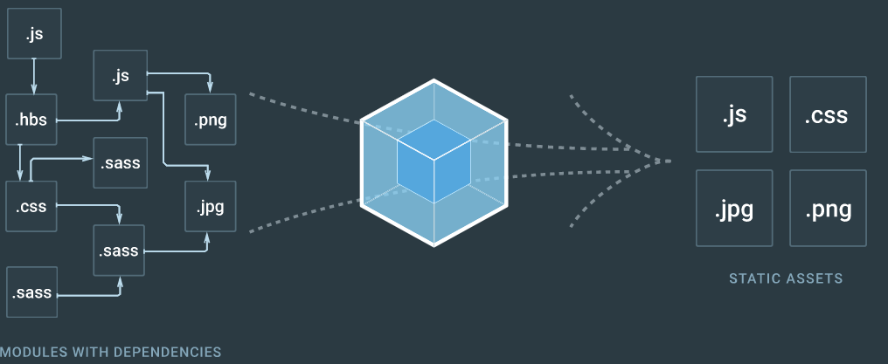
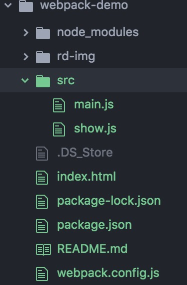
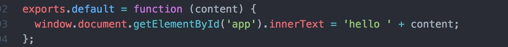
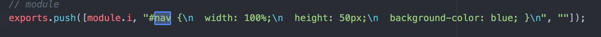
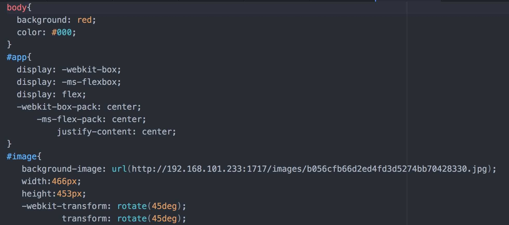
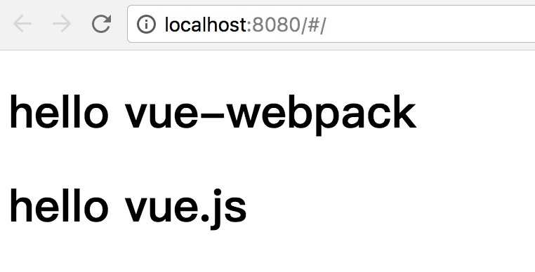

# webpack: 从入门到项目配置
> 该文使用的 Webpack 版本为 3.6.0，本文分两部分。第一步是简单的 webpack 配置项，第二部分通过一个真实项目来配置 webpack，没有使用任何的 CLI，都是配置打包的过程。

## webpack 是什么？
自从出现模块化以后，大家可以将原本一坨代码分离到个个模块中，但是由此引发了一个问题。每个 JS 文件都需要从服务器去拿，由此会导致加载速度变慢。Webpack 最主要的目的就是为了解决这个问题，将所有小文件打包成一个或多个大文件，官网的图片很好的诠释了这个事情，除此之外，Webpack 也是一个能让你使用各种前端新技术的工具。



## 模块化

### CommonJS
ommonJS 是一种使用广泛的 JavaScript 模块化规范，核心思想是通过 require 方法来同步地加载依赖的其他模块，通过 module.exports 导出需要暴露的接口。 CommonJS 规范的流行得益于 Node.js 采用了这种方式，后来这种方式被引入到了网页开发中。

采用 CommonJS 导入及导出时的代码如下：
```
// 导入
const moduleA = require('./moduleA');

// 导出
module.exports = moduleA.someFunc;
```
CommonJS 的优点在于：
- 代码可复用于 Node.js 环境下并运行，例如做同构应用；
- 通过 NPM 发布的很多第三方模块都采用了 CommonJS 规范。

CommonJS 的缺点在于这样的代码无法直接运行在浏览器环境下，必须通过工具转换成标准的 ES5。

### AMD
AMD 也是一种 JavaScript 模块化规范，与 CommonJS 最大的不同在于它采用异步的方式去加载依赖的模块。 AMD 规范主要是为了解决针对浏览器环境的模块化问题，最具代表性的实现是 requirejs。

采用 AMD 导入及导出时的代码如下：
```
// 定义一个模块
define('module', ['dep'], function(dep) {
  return exports;
});

// 导入和使用
require(['module'], function(module) {
});
```
AMD 的优点在于：
- 可在不转换代码的情况下直接在浏览器中运行；
- 可异步加载依赖；
- 可并行加载多个依赖；
- 代码可运行在浏览器环境和 Node.js 环境下。

AMD 的缺点在于JavaScript 运行环境没有原生支持 AMD，需要先导入实现了 AMD 的库后才能正常使用。

### ES6 模块化
ES6 模块化是国际标准化组织 ECMA 提出的 JavaScript 模块化规范，它在语言的层面上实现了模块化。浏览器厂商和 Node.js 都宣布要原生支持该规范。它将逐渐取代 CommonJS 和 AMD 规范，成为浏览器和服务器通用的模块解决方案。

采用 ES6 模块化导入及导出时的代码如下：

```
// 导入
import { readFile } from 'fs';
import React from 'react';
// 导出
export function hello() {};
export default {
  // ...
};
```
ES6模块虽然是终极模块化方案，但它的缺点在于目前无法直接运行在大部分 JavaScript 运行环境下，必须通过工具转换成标准的 ES5 后才能正常运行。

## 简单使用

### 安装

在命令行中依次输入

```
mkdir  webpack-demo
cd webpack-demo
// 创建 package.json， -y 直接跳过问题
npm init -y
// 推荐局部安装，不推荐全局安装
npm install --save-dev webpack

```
在下面的文件输入代码

```
// show.js
function show(content) {
  window.document.getElementById('app').innerText = 'hello ' + content
}
//导出show模块
module.exports = show
// index.js
//引入模块
const show = require('./show.js');
show('webpack')
```
```
<!DOCTYPE html>
<html>
  <head>
    <meta charset="utf-8">
    <title>webpack</title>
  </head>
  <body>
    <div id="app"></div>
    <script type="text/javascript" src="./dist/bundle.js"></script>
  </body>
</html>
```
现在我们开始配置最简单的 webpack，首先创建 webpack.config.js 文件，然后写入如下代码
```
// 自带的库
const path = require('path')

module.exports = {
  entry: './src/main.js',  //入口文件
  output: {
    filename: 'bundle.js', //打包后输出的文件名
    path: path.resolve(__dirname, './dist') //输出文件夹的绝对路径
  }
}
```
文件夹如图：

现在在命令行输入
```
node_modules/.bin/webpack
```
如果打包成功的话， 你会看到命令行输出的内容有hash值，webpack版本号，花费时间和打包出来文件的大小。如果我们认为这条命令很长，我们可以在package.json做一些修改。

```
"scripts": {
  "start": "webpack"
},
```
然后在命令行输入`npm run start`发现和上面那条命令运行效果是一样的。

## Loader

loader 让 webpack 能够去处理那些非 JavaScript 文件（webpack 自身只理解 JavaScript）。loader 可以将所有类型的文件转换为 webpack 能够处理的有效模块，然后你就可以利用 webpack 的打包能力，对它们进行处理。

### Babel
由于浏览器不能直接编译es6/es7/jsx这类语法， 所以需要用loader将这类语法转化为浏览器可以编译的语法。首先需要安装Babel的几个库。

```
npm i --save-dev babel-loader babel-core babel-preset-env  
babel-preset-react  //编译jsx语法
```
接下来改一下webpack.config.js如下：
```
module.exports = {
  //......
  module:{
    rules: [
      {
        // 用 babel-loader 转换 JavaScript和jsx 文件
        test: /\.(jsx|js)$/,
        // ?cacheDirectory 表示传给 babel-loader 的参数，用于缓存 babel 编译结果加快重新编译速度
        use: ['babel-loader?cacheDirectory'],
        // 表示只对src目录下的文件起作用
        include: path.resolve(__dirname, 'src')
      }
    ]
  }
}
```
配置 Babel 有很多方式，这里推荐使用 .babelrc 文件管理。

```
// ..babelrc
{
    "presets": ["babel-preset-env"]
}
```
将之前的js代码转为es6代码
```
//show.js

export default (content) => {
  window.document.getElementById('app').innerText = `hello ${content}`
}

//main.js

import show from './show.js'

show('webpack')
```
命令行`npm run start`编译一下，打开bundle.js看到已经编译成es5语法


### 处理css文件
因为webpack不能直接处理css文件， 所以我们需要装两个loader：
```
npm install style-loader css-loader --save-dev
```
看两个loader的作用
- css-loader 它是用来处理css文件中的url(),前者可以让 CSS 文件也支持 impost,并解释css-loader
- style-loader 将解析出来的css插入到html中去

建立index.css文件夹,代码如下：
/src/index.css
```
body{
  background: red;
  color: #fff;
}
```
修改webpack.config.js文件
```
module.exports = {
  //......
      {
        test: /\.css$/,
        // minimize告诉css开启压缩
        use: ['style-loader', 'css-loader?minimize']
      }
    ]
  }
}
```
打开控制台，检查元素可以看到样式已经添加到页面中
#### css文件分离

虽然webpack不推荐将css文件分离，因为分离增加请求数量，但是需求不是问们能决定的，有时候我们还是要分离的
我们可以安装
```
npm install --save-dev extract-text-webpack-plugin
```
然后配置webpack.config.js如下：

```
const extractTextPlugin = require("extract-text-webpack-plugin");
把之前的css的loader更改为
module:{
 .....
 // 之前的css更改为
    {
      test: /\.css$/,
      use: extractTextPlugin.extract({
        use: "css-loader"
      })
    }
  .....

  // plugins 中配置
  plugins: [
    new extractTextPlugin("css/index.css") // css打包后的路径
  ]    
```

打包之后我们可以看到css文件分离出来，页面也可以正常显示。

### 处理图片文件
因为webpack不能直接处理css文件， 所以我们需要装两个loader：
```
 npm install --save-dev file-loader url-loader
```

两个loader的作用
- file-loader 解决路径问题，webpack打包后成为js文件，图片路径是相对于html的而不是我们之前的css文件，这样的话就会报错，file-loader就很好的解决了这个问题
- url-loader 如果图片过多就会造成很多的http请求，url-loader 将图片转化为字符串编码，这样请求图片的时候就不用http请求了，如果图片过大，编码时间过长，因此url-loader提供了一个limit参数，小于这个参数的将转化为编码，大于的不转化

下面我们在html标签中加入以下代码：
```
<div id="image"></div>
```
在css文件中给image添加样式：
```
#image{
   background-image: url(./images/zly.jpg);
   width:466px;
   height:453px;
}
```
配置webpack.config.js文件
```
module:{
......
    {
      test: /\.(png|gif|jpg)$/,
      use: [{
        loader: 'url-loader',
        options: {
          limit: 50000 // 如果图片大小小于limit的值，那么图片将会打包成Base64格式，写入到js里面
        }
      }]
    }
.....
```

#### 为什么只使用了url-loader

我们发现并没有在webpack.config.js中使用file-loader，但是依然打包成功了。我们需要了解file-loader和url-loader的关系。url-loader和file-loader是什么关系呢？简答地说，url-loader封装了file-loader。url-loader不依赖于file-loader，即使用url-loader时，只需要安装url-loader即可，不需要安装file-loader，因为url-loader内置了file-loader。通过上面的介绍，我们可以看到，url-loader工作分两种情况：
- 文件大于limit的值，url-loader会调用file-loader进行处理，参数也会直接传给file-loader
- 文件小于limit的值，url-loader将会把文件转为Base64格式

打包成功后发现图片没有显示出来，看一下打包的css文件的路径，发现css分离后路径错误，我在网上找了一个有效的方法，在说之前我们应该了解一下热更新，就是我们写代码的时候，想看效果不需要再次打包，我们在双屏幕下就能加快开发效率。

首先我们使用npm安装webpack-dev-server，命令如下：

```
npm install webpack-dev-server --save-dev
```

接下来配置webpack.config.js
```
  devServer:{
      //设置基本目录结构
      contentBase:path.resolve(__dirname,'dist'),
      //服务器的IP地址，可以使用IP也可以使用localhost
      host:'localhost',
      //服务端压缩是否开启
      compress:true,
      //配置服务端口号
      port:1717
  }
```

现在我们还不能直接在命令行中用webpack-dev-server，我们需要在package.json中配置一下， 配置如下：

```
"scripts": {
  ......
  "server": "webpack-dev-server --open"
},
```

然后我们在浏览器地址栏输入我们就可以看到效果， 我们试着更改一下代码， 我们就可以体会到他的便捷了。

现在我们该解决图片路径问题了，这种方法也是我感觉到比较好的方式，更改webpack.config.js文件

```
const website ={
    publicPath:"http://192.168.101.233:1717/"
}

// 添加出口的输出路径
output: {
  path: path.resolve(__dirname, 'dist'),
  filename: 'bundle.js',
  publicPath: website.publicPath
}
```

然后用webpack命令打包， 在浏览器中输入`http://192.168.101.233:1717/`我们看到图片出来了，现在有个问题，webpack不希望我们在html中用img标签，如我们我们想要写img标签的话， 我们需要安装一个loader,安装命令如下：
```
npm install html-withimg-loader --save
```
然后配置webpack.config.js文件：
```
module:{
......
    {
        test: /\.(htm|html)$/i,
         use:[ 'html-withimg-loader']
    },
......
  ]
},
```

然后在命令行中进行打包， 我们可以在在地址栏输入然后查看效果


### 处理scss文件
sass 使我们常用的css预处理语言， 处理scss文件前我们要先安装两个loader，命令如下：
```
npm install --save-dev node-sass sass-loader
```
然后配置webpack.config.js文件

/src/style/style.scss
```
$color: blue;

// 记得在html文件中加入id为nav的div标签
#nav{
 width: 100%;
 height: 50px;
 background-color: $color;
}
```

```
module:{
......
    {
      test: /\.scss$/,
      use: ['style-loader', 'css-loader', 'sass-loader']
    },
```

接下来我们在命令行打包，然后在地址栏输入，我们就可以看到效果，我们也可以看一下bundle.js文件


最后我们也可以将sass分离出去，我们把之前sass的loader改一下
```
{
  test: /\.scss$/,
  use: extractTextPlugin.extract({
    use: [
      {
        loader: 'css-loader'
      },
      {
        loader: 'sass-loader'
      }
    ]
  })
}
```

命令行打包之后我们可以看到scss文件的内容分离到index.css中去了

### postcss-loader让css兼容各个浏览器

在我们写css3样式的时候，有些样式我们必须写浏览器的前缀才能兼容各大浏览器，但是我们不一定能记住所有，好在postcss-loader帮我们处理的这些事情， 接下来我们就开始了解一下吧

首先需要安装如下：
```
  npm install --save-dev postcss-loader postcss-cssnext
```

编写loader

webpack.config.js

```
module:{
  rules: [
  ......
    {
      test: /\.css$/,
      use: extractTextPlugin.extract({
        use: [
          { loader: "css-loader",
             options: {
               //这里可以简单理解为，如果css文档中有import 进来的文档也进行处理
               importLoaders: 1
             }
          },
          {loader: "postcss-loader"}
        ]
      })
    },
  .....
```
postcss.config.js

postCSS推荐在项目根目录（和webpack.config.js同级），建立一个postcss.config.js文件。

```
module.exports = {
    // 需要使用的插件列表
    plugins: [
        // 可以使用下一代css的写法
        require('postcss-cssnext')
    ]
}
```
index.css

```
:root {
  --red: red;
}
body{
  background: var(--red);
  color: #000;
}
#app{
  display: flex;
  justify-content: center;
}
#image{
   background-image: url(./images/zly.jpg);
   width:466px;
   height:453px;
   transform: rotate(45deg);
}
```

然后我们命令行运行可以后我们打开dist下面的css文件如下：



更多配置请查看 [github地址](https://github.com/postcss/postcss-loader)


## plugins

Plugin 是用来扩展 Webpack 功能的，通过在构建流程里注入钩子实现，它给 Webpack 带来了很大的灵活性。

我们在之前css分离的时候已经用到了`extractTextPlugin`， 它的作用是将js中的css代码抽离到一个文件中
```
plugins: [
   new extractTextPlugin({
      // name 是文件的名称也就是main  contenthash:8 是取8位hash值
      filename: `src/[name]_[contenthash:8].css`
   }),
```

#### 生成html文件

首先我们配置webpack.config.js文件，先引入我们的html-webpack-plugin插件。

首先命令行安装一个包：
```
npm install --save-dev html-webpack-plugin
```

webpack.config.js
```
const htmlPlugin= require('html-webpack-plugin');

plugins: [
.....
  new htmlPlugin({
      // 对html文件压缩
       minify:{
           // true 去掉双引号 false相反
           removeAttributeQuotes:true
       },
       // hash值避免js有缓存
       hash:true,
       // 打包后的名称
       template:'./src/index.html'

   })
]
```
最后我们将dist目录下的index.html文件去掉， 在src下面创建html文件，打包后我们发现dist下面生成了html文件
还有一个`web-webpack-plugin` 和 `html-webpack-plugin` 有一样的功能 详情看[github](https://github.com/gwuhaolin/web-webpack-plugin)


#### js压缩

webpack中已经集成了一个webpack.config.js，不需要安装

webpack.config.js
```
const uglify = require('uglifyjs-webpack-plugin');

plugins:[
    new uglify()
],
```

需要注意的是压缩和热更不能同时使用，压缩 一般在生产环境

## 加载 Source Map

在使用webpack时只要通过简单的devtool配置，webapck就会自动给我们生产source maps 文件，map文件是一种对应编译文件和源文件的方法，让我们调试起来更简单。

在配置devtool时，webpack给我们提供了四种选项。

- source-map:在一个单独文件中产生一个完整且功能完全的文件。这个文件具有最好的source map,但是它会减慢打包速度；
- cheap-module-source-map:在一个单独的文件中产生一个不带列映射的map，不带列映射提高了打包速度，但是也使得浏览器开发者工具只能对应到具体的行，不能对应到具体的列（符号）,会对调试造成不便。
- eval-source-map:使用eval打包源文件模块，在同一个文件中生产干净的完整版的sourcemap，但是对打包后输出的JS文件的执行具有性能和安全的隐患。在开发阶段这是一个非常好的选项，在生产阶段则一定要不开启这个选项。
- cheap-module-eval-source-map:这是在打包文件时最快的生产source map的方法，生产的 Source map 会和打包后的JavaScript文件同行显示，没有影射列，和eval-source-map选项具有相似的缺点。

四种打包模式，有上到下打包速度越来越快，不过同时也具有越来越多的负面作用，较快的打包速度的后果就是对执行和调试有一定的影响。source- map只适合开发阶段，上线前记得修改这些调试设置。


## 开始配置一个vue的项目环境

把之前的删除，重新配置，首先 `npm init -y`来创建一个package.json,然后再命令行安装依赖
```
// 依次安装下面的包
"dependencies": {
  "vue": "^2.5.13",
  "vue-loader": "^13.7.0",
  "vue-router": "^3.0.1",
  "vue-template-compiler": "^2.5.13",
  "webpack-dev-server": "^2.11.1"
}
```

需要注意的是 `vue`和`vue-template-compiler` 的版本要保持一致，否之会报错。

### 开始配置webpack

webpack.config.js
```
const path = require('path')
module.exports = {
  entry: './src/main.js', // 入口
  output: {  // 出口
    path: path.resolve(__dirname, 'dist'),
    filename: 'bundle.js'
  },
  module: {
    rules: [
      {
        test: /\.vue$/,
        use: ["vue-loader"]  // 处理.vue文件
      }
    ]
  }
}
```

### 入口配置

./src/main.js
```
  import Vue from 'vue';
  import App from './app.vue';
  import router from './router'; // 路由

  Vue.config.productionTip = false

  new Vue({
    el: '#app',
    router,
    render: h => h(App)
  })
```

### 页面配置

index.html
```
<!DOCTYPE html>
<html>
  <head>
    <meta charset="utf-8">
    <title>vue-webpack</title>
  </head>
  <body>
  <div id="app"></div>
   <script type="text/javascript" src="dist/bundle.js"></script>
  </body>
</html>
```
./src/app.Vue
```
<template id="">
  <div id="App">
    <h1>hello vue-webpack</h1>

    <router-view /> // 路由视图
  </div>
</template>

<script type="text/javascript">
  export default{}
</script>
```

./src/components/HelloWorld.vue
```
  <template id="">
    <div id="hello">
      <h1>hello vue.js</h1>
    </div>
  </template>

  <script type="text/javascript">
    export default{

    }
  </script>
```

### 路由的配置

./src/router/index.js
```
import Vue from 'vue'
import Router from 'vue-router'
import HelloWorld from '../components/HelloWorld.vue'

Vue.use(Router)

export default new Router({
  routes: [
    {
      path: '/',
      component: HelloWorld
    }
  ]
})
```

### 配置package.json

package.json
```
"scripts": {
  "dev": "webpack-dev-server --hot --open"
},
```

接下来命令行输入`webpack`打包， 打包成功后输入`npm run dev`,浏览器会自动打开，显示如下：

