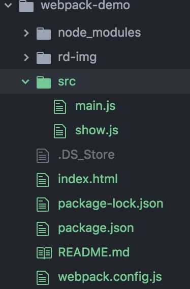

# webpack: 从入门到项目配置
> 该文使用的 Webpack 版本为 3.6.0，本文分两部分。第一步是简单的 webpack 配置项，第二部分通过一个真实项目来配置 webpack，没有使用任何的 CLI，都是配置打包的过程。

## webpack 是什么？
自从出现模块化以后，大家可以将原本一坨代码分离到个个模块中，但是由此引发了一个问题。每个 JS 文件都需要从服务器去拿，由此会导致加载速度变慢。Webpack 最主要的目的就是为了解决这个问题，将所有小文件打包成一个或多个大文件，官网的图片很好的诠释了这个事情，除此之外，Webpack 也是一个能让你使用各种前端新技术的工具。


## 模块化

### CommonJS
ommonJS 是一种使用广泛的 JavaScript 模块化规范，核心思想是通过 require 方法来同步地加载依赖的其他模块，通过 module.exports 导出需要暴露的接口。 CommonJS 规范的流行得益于 Node.js 采用了这种方式，后来这种方式被引入到了网页开发中。

采用 CommonJS 导入及导出时的代码如下：
```
// 导入
const moduleA = require('./moduleA');

// 导出
module.exports = moduleA.someFunc;
```
CommonJS 的优点在于：
- 代码可复用于 Node.js 环境下并运行，例如做同构应用；
- 通过 NPM 发布的很多第三方模块都采用了 CommonJS 规范。

CommonJS 的缺点在于这样的代码无法直接运行在浏览器环境下，必须通过工具转换成标准的 ES5。

### AMD
AMD 也是一种 JavaScript 模块化规范，与 CommonJS 最大的不同在于它采用异步的方式去加载依赖的模块。 AMD 规范主要是为了解决针对浏览器环境的模块化问题，最具代表性的实现是 requirejs。

采用 AMD 导入及导出时的代码如下：
```
// 定义一个模块
define('module', ['dep'], function(dep) {
  return exports;
});

// 导入和使用
require(['module'], function(module) {
});
```
AMD 的优点在于：
- 可在不转换代码的情况下直接在浏览器中运行；
- 可异步加载依赖；
- 可并行加载多个依赖；
- 代码可运行在浏览器环境和 Node.js 环境下。

AMD 的缺点在于JavaScript 运行环境没有原生支持 AMD，需要先导入实现了 AMD 的库后才能正常使用。

### ES6 模块化
ES6 模块化是国际标准化组织 ECMA 提出的 JavaScript 模块化规范，它在语言的层面上实现了模块化。浏览器厂商和 Node.js 都宣布要原生支持该规范。它将逐渐取代 CommonJS 和 AMD 规范，成为浏览器和服务器通用的模块解决方案。

采用 ES6 模块化导入及导出时的代码如下：

```
// 导入
import { readFile } from 'fs';
import React from 'react';
// 导出
export function hello() {};
export default {
  // ...
};
```
ES6模块虽然是终极模块化方案，但它的缺点在于目前无法直接运行在大部分 JavaScript 运行环境下，必须通过工具转换成标准的 ES5 后才能正常运行。

## 简单使用

### 安装

在命令行中依次输入

```
mkdir  webpack-demo
cd webpack-demo
// 创建 package.json， -y 直接跳过问题
npm init -y
// 推荐局部安装，不推荐全局安装
npm install --save-dev webpack

```
在下面的文件输入代码

```
// show.js
function show(content) {
  window.document.getElementById('app').innerText = 'hello ' + content
}
//导出show模块
module.exports = show
// index.js
//引入模块
const show = require('./show.js');
show('webpack')
```
```
<!DOCTYPE html>
<html>
  <head>
    <meta charset="utf-8">
    <title>webpack</title>
  </head>
  <body>
    <div id="app"></div>
    <script type="text/javascript" src="./dist/bundle.js"></script>
  </body>
</html>
```
现在我们开始配置最简单的 webpack，首先创建 webpack.config.js 文件，然后写入如下代码
```
// 自带的库
const path = require('path')

module.exports = {
  entry: './src/main.js',  //入口文件
  output: {
    filename: 'bundle.js', //打包后输出的文件名
    path: path.resolve(__dirname, './dist') //输出文件夹的绝对路径
  }
}
```
文件夹如图：

现在在命令行输入
```
node_modules/.bin/webpack
```
如果打包成功的话， 你会看到命令行输出的内容有hash值，webpack版本号，花费时间和打包出来文件的大小。如果我们认为这条命令很长，我们可以在package.json做一些修改。

```
"scripts": {
  "start": "webpack"
},
```
然后在命令行输入`npm run start`发现和上面那条命令运行效果是一样的。
